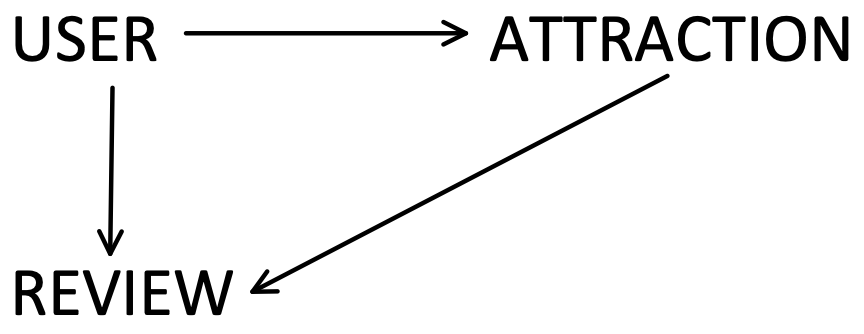
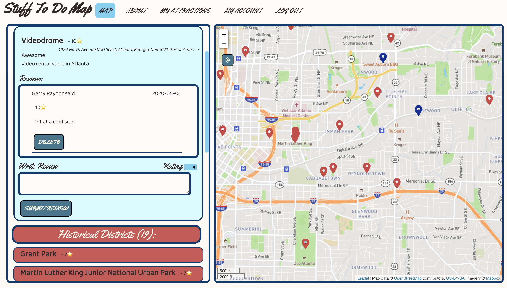
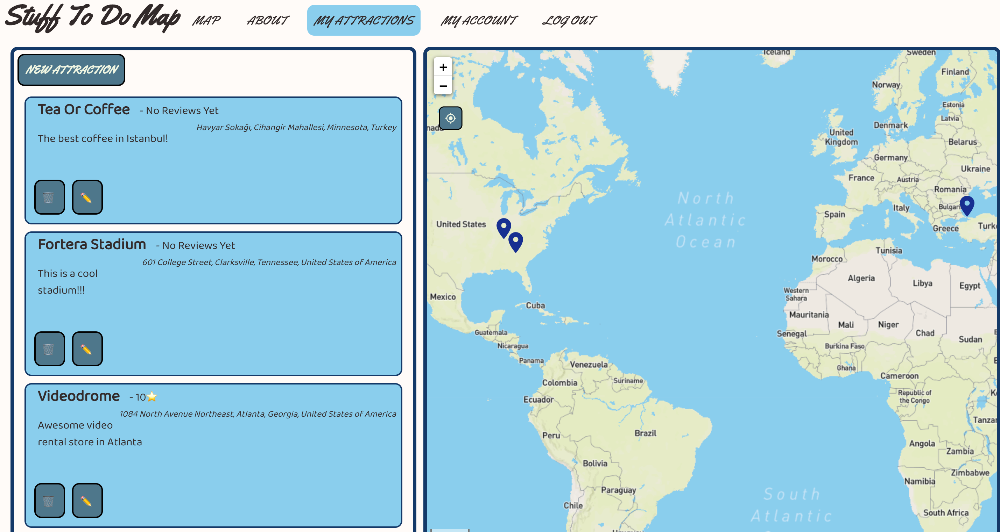
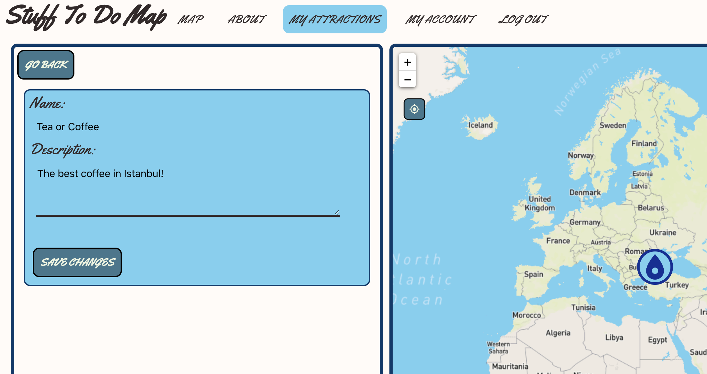
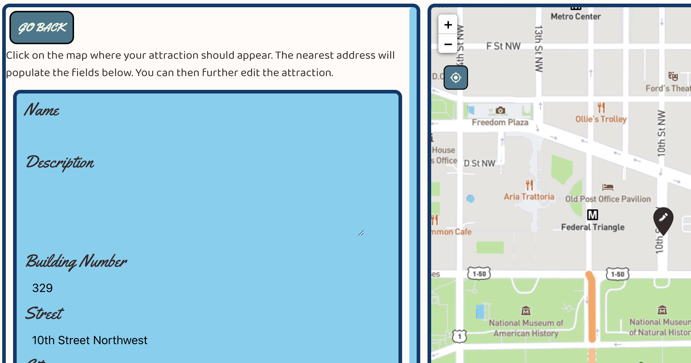
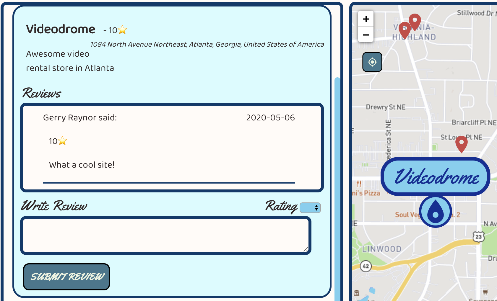

# Stuff To Do Map - Frontend 
_An app to find something to do no matter where you are_

## Background 
Stuff To Do Map was created as my final project for Flatiron School’s Immersive Software Engineering program. I was inspired to create it after traveling abroad in the summer of 2019. As I was journeying to new cities and looking online for things to do, I found a lack of sites that let me find things to do around my current location. I wanted to see a map, know where I was, and know what was around me, without having to wade through multiple listacles and look up addresses myself. Thus, Stuff To Do Map was born. 

## Functionality 
Users can: 
- View a map of the world and see all attractions made by users or received from the OpenTripMap API. 
- Find their location on the map with the click of a button. 
- Click on attraction markers on the map to find out more about that attraction. 
- Use the app in both mobile and desktop modes. 
- Pan and zoom across the map to see only attraction markers within the bounds of the map’s current view. 
- Create an account with details about themselves. 
- Edit their account details including email address and password, with password verification required for all account changes. 
- Delete their account.
- Add new attractions to a map for all other users to see. Attractions include their latitude and longitude, address, name, and a short description. 
- Edit the names and descriptions of attractions they have made. 
- Delete attractions they have made. 
- Write attraction reviews, which include a 1-10 star rating.
- Delete their reviews. 

## Association Wireframes 

- User has many reviews 
- Review belongs to user 
- User has many attractions 
- Attraction belongs to user 
- Attraction has many reviews
- Review belongs to attraction 

## Tools and Technologies 
- HTML, CSS, Javascript 
- [React JS](https://reactjs.org/) - Used for quick development time, reusable components, and ease of porting to mobile if I choose to later. Used for the view portion of the MVC. 
- [React Redux](https://react-redux.js.org/introduction/quick-start) - Used for keeping a single store shared amongst whichever components need it. This drastically reduced development time. 
- [React Router](https://reacttraining.com/react-router/) - Used to give my single page application a kind of traditional website feel for its routes. 
- [Animate CSS](https://daneden.github.io/animate.css/) - Used for pleasant animations for elements while they load, but overtime I removed many instances of its use because it felt too ‘busy’. 
- [Google Material Icons](https://material.io/resources/icons/?style=baseline) - Used some of their map icons on the map pages. Easily styled with CSS.
- [Leafet JS](https://leafletjs.com/) - Used to quickly create a functional map. Leaflet provides many functions that I needed out of the box such as displaying map markers, marker click functionality, bounding box, reading data from the map (lng/lat, zoom level), and more. 
- [MapBox](https://www.mapbox.com/) - The map I used to present marker data on (Leaflet does not include a map). 
- [OpenTripMap](https://opentripmap.io/product) - Used for its enormous amount of data and easy to use API. Provides data on tens of thousands of places ranging from hotels to restaurants to architecture to nature trails. I only used historical district data because anything more overcrowds the map. 
- [Nominatim](http://nominatim.org/) - Used this API to send it a set of coordinates and receive the closest address to those coordinates. This is used when users are creating markers. 
- [Ruby 2.6](https://www.ruby-lang.org/en/), [Ruby on Rails 6.0.2.2](https://rubyonrails.org/) - Used to create the model and controller portions of the MVC. Currently hosted on Heroku. 
- [DOTENV](https://github.com/bkeepers/dotenv) - Used to store environmental variables such as API keys during development. 
- [JSON Web Tokens](https://jwt.io/) - Used to securely prevent the need to re-authentice the user while they are logged in.
- [BCrypt 3.1.7](https://github.com/codahale/bcrypt-ruby) - Used to securely store user information on the backend. 
- [Faker](https://github.com/faker-ruby/faker.git) - Used to quickly create fake data for testing. 

## Usage 

To see how to use Stuff To Do Map yourself, check it out at [stufftodomap.com](www.stufftodomap.com)!

The root page shows the user a map of Atlanta, the default view for Stuff To Do Map. The user can click on markers to find information about that attraction. Red markers are OpenTripMap markers, blue markers are user markers. The user can click the blue location icon at the top left of the map to move the map to their location. 

Once a user has logged in they can view the attractions they have made. 

From here they can edit (shown below) an attraction with the ✏️ button or delete an attraction with the 🗑 button. 

Users can also use this page to add new attractions. Shown below, the user clicked on the map and an icon appeared where they clicked. That click sent a request to the Nominatim API for the closest address data, which was automatically filled in when received. 

Users can leave text reviews for user attractions and give them a 1-10 star rating. 

## Challenges and What I Learned 

Building the frontend for Stuff To Do Map was a challenging and rewarding experience. Because the focus of Stuff To Do Map is the frontend presentation, I put a *lot* more time and energy into the frontend than I did the backend. I wanted to create an application that was a pleasure to look at and use, and I think I have definitely succeeded at that. 

The biggest challenge was deciding how to present the information in a readable way. I knew I wanted to emulate the Google Maps style of presentation, with a list of attractions on the left with their markers presented on a map on the right. I decided to format the attraction list and map using ‘float: left;’ on the attraction list and letting the map align itself accordingly, but in hindsight I should have used CSS grid to align the items. Using grid would have made the process of making the site work on mobile a lot easier. 

Another challenge was the color selection. I wanted to keep the application readable and simple, because I only had two weeks to work on it and I wanted this to be a utility application, an application whose data could be parsed quickly and easily. I decided to use a nice red and blue color scheme with a white background. The red and blue contrast each other enough that the user can easily parse the difference in the information they present (that information being which markers on the map and listings in the attraction list are from users (blue) or from OpenTripMap data (red)) while still offering an appealing set of nearly (though not _technically_) complementary colors.

The next big design challenge was what font to use. Font selection is something of a weakness for me. While I can spot a well utilized font, I have little experience selecting fonts myself. I found [Yellowtail](https://fonts.google.com/specimen/Yellowtail?selection.family=Yellowtail&sidebar.open) while perusing Google Fonts and knew it was exactly what I needed. When I saw Yellowtail, I thought immediately of the USA National Forest signs used all across the United States. These invoke in me a sense of adventure and exploration, but also a calm that comes from associating those signs with the peace and innocence of the 1960s and (oddly enough) Yogi Bear. I used Yellowtail for the headers and any kind of title element like labels and decided on [Baloo Bhaina 2](https://fonts.google.com/specimen/Baloo+Bhaina+2) for everything else. 

Stuff To Do Map was always intended to be used on mobile, and a big challenge has been learning how to keep it mobile and desktop ready. The application should really _feel_ like an application, not a website, so making sure that when users visit the page on their phone they do not feel like they’re getting a subpar experience was a big focus. I ultimately only used one media query, ‘max-width: 870px’, and made two versions of the site based on this. I did some research and decided to move the navigation bar to the bottom of the page to accommodate those with large phones, and changed the navigation bar’s parent element to use CSS grid so I could format its child elements in a consistent manner. 

Depending on if the user is on a page with a map, found using React Router’s history prop, a button to show or hide the list of attractions appears. This button toggles the ‘showList’ class on the attraction list. That way the map can take the entire screen and the attraction list is optional. This can be further refined, but I’ll go into that in the next section. 

## Next Steps 

- Add a search bar to the map components so users can find attractions in specific areas without finding them manually. 
- Add a filter or sort button to sort attractions by rating. 
- Refine the mobile site to ensure the height of the non-navigation bar content lines up correctly with the height of the screen (the url bar is causing this to be different across devices).
- Make the app a Progressive Web App (PWA) to give the best experience possible on mobile. 
- Redo the main container on both desktop and mobile to use CSS grid or flexbox for easier alignment of elements. 
- Change the CSS for mobile to use touch actions instead of hover selectors.
